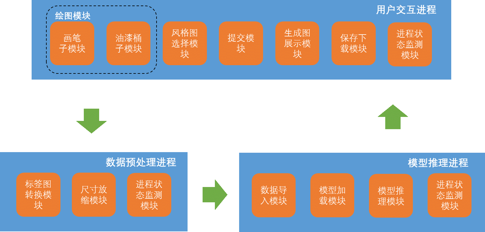

# 使用介绍
本项目使用了SPADE项目的网络：https://github.com/NVlabs/SPADE
预训练模型请在此项目提供的谷歌云盘下载，放到路径：./src/checkpoints/ade20k_pretrained/latest_net_G.pth。
本项目仅用于我的课程设计，请勿商用。
直接运行src目录下的draw_board.py即可。按esc键可以清空画板。
# 一、概述： 

本系统的主要面向用户是影视特效设计人员和普通群众，并力求达到以下目标：

1. 影视后期制作行业的从业人员运用本产品，通过简单的勾勒轮廓和设定风格快速生成目标背景图片。

2. 不具备专业水平的普通用户也可以运用本产品，通过随意勾勒轮廓和设定风格得到令人惊喜的作品。

本软件的开发设计过程中，参考了刘明宇等人的论文Semantic Image Synthesis with Spatially-Adaptive Normalization[1]中提出的GauGAN模型。

本软件产品是一项独立的软件，不属于某个更大的系统，全部内容自含。

[1] Park T, Liu M Y, Wang T C, et al. Semantic image synthesis with spatially-adaptive normalization[C]//Proceedings of the IEEE Conference on Computer Vision and Pattern Recognition. 2019: 2337-2346.

# 二、项目需求： 

1. 通过绘图交互界面生成指定label的设计图，并提供多种编辑功能

2. 从外部导入指定label的设计图

3. 提供丰富的设计风格

4. 将设计图转换为对应的背景图片

5. 将生成背景图片导出 

# 三、系统功能： 

1. 通过绘图交互界面指定生成图片各个位置的label，作为GauGAN模型输入。 

2. 支持从本地硬盘导入文件作为GauGAN模型输入

3. 支持多种预设风格，提供丰富的输出风格

4. 支持生成背景图片导出为JPG文件.  

# 四、平台： 

1. 开发环境 

计算机硬件DELL E5450

操作系统： Windows 10

CPU：1G

内存：256M

硬盘：128G以上 

开发环境： Python 3.8 + PyCharm

 

2. 运行环境 

客户端操作系统： Windows 7/8.1/10

CPU：1G

内存：256M

硬盘：剩余>1G 

 

 

# 五、系统逻辑结构图： 

整个系统包含六部分： 

1， 用户交互进程 

  该进程负责生成交互界面，引导用户指定生成图片各个位置的label，并指定风格参数，作为GauGAN模型输入。并将背景图片在交互界面上展示并提供保存修改选项 

2， 数据预处理进程 

  对交互界面获取的数据做预处理，根据颜色与label对应关系转换数据并对不符合尺寸约束的文件进行放缩预处理，作为GauGAN模型输入

3，模型推理进程

​    根据输入推导出对应的背景图片 

 

 

# 六、模块划分和接口设计： 

**1.绘图模块**

【画笔子模块功能】：提供画笔功能，在画布上作画。仅支持黑色画笔，支持不同粗细的画笔。

【油漆桶子模块功能】：提供油漆桶功能，在画布上作画。支持20种预设的颜色，一种颜色对应一种类别。

【和其他模块的接口】：向提交模块提供绘制好的图像。

**2.风格图选择模块**

【功能】：预设四种图片风格，用户选择其中一种打勾。

【和其他模块的接口】：向提交模块提供选择图片风格的编号。

**3.提交模块**

【功能】：在交互界面上显示提交按钮，按下后，将画布上的画作和预设风格图编号传输给数据预处理模块，并启动数据预处理模块。

【和其他模块的接口】：向数据预处理模块提供用户绘图和预设风格图编号。

**4.生成图展示模块**

【功能】：检测到图片生成后，启动新窗口，向用户展示生成的图像。

【和其他模块的接口】：接收来自模型推理模块的输出，接收进程检测模块的启动信号。

**5.保存下载模块**

【功能】：在生成图展示模块启动的新窗口中显示下载按钮，按下后保存到默认文件夹中。

【和其他模块的接口】：接收来自生成图展示模块的生成图片。

**6.标签图转换模块**

【功能】：从用户绘制好的图像种提取预设的20种颜色的像素分布，将颜色和预设类别相对应，生成语义标签图。

【和其他模块的接口】：接收来自提交模块的绘制图像，输出语义标签图到尺寸放缩模块。

**7.尺寸放缩模块**

【功能】：将输入图像调整到适合于模型处理的大小

【和其他模块的接口】：接收来自标签图转换模块的语义标签图，输出调整大小后的图像到数据导入模块。

**8.数据导入模块**

【功能】：将语义标签图导入至模型，将风格图编号对应到风格图导入至模型。

【和其他模块的接口】：输入来自尺寸放缩模块，输出到模型推理模块.

**9.模型加载模块**

【功能】：提交图片后即开始运行，导入模型参数至内存，为模型推理做准备。

【和其他模块接口】：向模型推理模块提供模型参数。

**10.模型推理模块**

【功能】：推理得到具有风格图风格的，且具有语义标签图类别分布的生成图。

【和其他模块的接口】：接收来自数据加载模块的语义标签图和预设风格图，向生成图展示模块提供生成的图像。

**11.进程状态检测模块**

【功能】监测各进程是否启动，是否有输出，以使各进程协同运转。

【和其他模块的接口】：监测提交模块动作，监测尺寸放缩模块输出，监测推理模块输出。

# 七、进度安排： 

|           | 用户交互进程                         | 数据预处理进程                 | 模型推理进程                        |
| --------- | ------------------------------------ | ------------------------------ | ----------------------------------- |
| 4.1-4.30  | 实现用户交互模块原型设计             | 明晰需要的类别，和预处理的步骤 | Linux下代码实现并跑通模型           |
| 5.1-5.31  | 实现用户交互各模块                   | 实现图像预处理模块             | 实现模型推理进程到Windows系统的迁移 |
| 6.1-6.10  | 融合各模块形成完整系统，测试系统表现 |                                |                                     |
| 6.10-6.20 | 形成详细设计文档和汇报PPT            |                                |                                     |
|           |                                      |                                |                                     |
|           |                                      |                                |                                     |

 